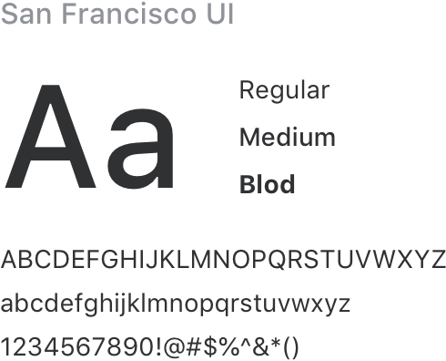

# Typography 字体

尽管宋体是政府文档的标准字体，考虑到我们的系统主要在电子屏幕上使用，我们选择了更适合屏幕显示的字体，对字体进行统一规范，力求在各个操作系统下都有最佳展示效果。因为未涉及到打印和文件编辑，所以未将宋体作为默认字体。字体设计参考了ElementUI。


## Font-family 代码
```css
font-family: "Helvetica Neue",Helvetica,"PingFang SC","Hiragino Sans GB","Microsoft YaHei","微软雅黑",Arial,sans-serif;
```


<div class="demo-typography-imgs">
	
	
	
	
	
	
</div>

## 字号

<table style="width:100%; display:table;">
  <thead>
    <tr>
      <th>层级</th>
      <th>字体大小</th>
      <th>举例</th>
    </tr>
  </thead>
  <tbody>
    <tr>
      <td style="font-size: 12px;">辅助文字</td>
      <td style="font-size: 12px;">12px Extra Small</td>
      <td style="font-size: 12px;">用 Element 快速搭建页面</td>
    </tr>
    <tr>
      <td style="font-size: 13px;">正文（小）</td>
      <td style="font-size: 13px;">13px Small</td>
      <td style="font-size: 13px;">用 Element 快速搭建页面</td>
    </tr>
    <tr>
      <td style="font-size: 14px;">正文</td>
      <td style="font-size: 14px;">14px Base</td>
      <td style="font-size: 14px;">用 Element 快速搭建页面</td>
    </tr>
    <tr>
      <td style="font-size: 16px;">小标题</td>
      <td style="font-size: 16px;">16px Medium</td>
      <td style="font-size: 16px;">用 Element 快速搭建页面</td>
    </tr>
    <tr>
      <td style="font-size: 18px;">标题</td>
      <td style="font-size: 18px;">18px large</td>
      <td style="font-size: 18px;">用 Element 快速搭建页面</td>
    </tr>
    <tr>
      <td style="font-size: 20px;">主标题</td>
      <td style="font-size: 20px;">20px Extra large</td>
      <td style="font-size: 20px;">用 Element 快速搭建页面</td>
    </tr>
  </tbody>
</table>
